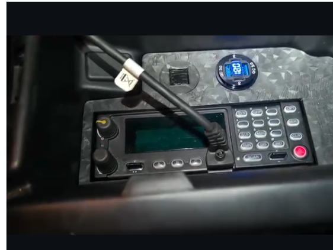

# Harris XG-100M Vehicle Integration

Private draft. Do not publish yet.

## Objective

Document a hands-on vehicle communications integration project centered on a Harris XG-100M mobile radio. The emphasis is physical installation, console fitment, speaker integration, accessory/interface planning, and verification.

This repository is being built as evidence for communications-equipment installation and field-service roles. It should show the practical path from radio placement to speaker integration, wiring/interface planning, testing, and final review.

## Evidence Gallery

See [docs/evidence-gallery.md](docs/evidence-gallery.md) for the current private image set pulled from Instagram evidence posts.

Lead evidence:

## Case Study Structure

### 1. Installation Goal

- Integrate a Harris XG-100M into a vehicle in a way that is usable, serviceable, and mechanically secure.
- Keep controls, audio, and supporting equipment reachable without creating unsafe clutter.
- Preserve a clean path for future accessory, speaker, data, and power work.

### 2. Physical Fitment

- Console space and mounting constraints.
- Speaker grille/fabrication work and console fitment.
- Follow-on mounting, cable-routing, and accessory-interface planning.

### 3. Electrical and Interface Planning

- Power-source planning and fuse/battery considerations.
- Speaker/audio integration.
- Accessory connector planning and cable-routing concepts.
- Redaction required before any public diagrams: no proprietary pinouts, codeplugs, keys, serials, or live operational configuration.

### 4. Testing and Validation

- Radio boot/progress checks.
- Audio/speaker verification.
- Final visual review for sensitive display or device details before any public release.

### 5. Troubleshooting Notes

Use the field-service pattern:

1. Symptom
2. Investigation
3. Measurement or inspection
4. Diagnosis
5. Corrective action
6. Verification

## Current Evidence Inputs

- XG-100M installation progress.
- XG-100M center-console speaker integration carousel, all 3 images.

See [evidence-manifest.md](evidence-manifest.md) for source URLs and review notes.

## Sensitive Material Boundary

This repository must not publish:

- encryption keys or key-fill material
- proprietary Harris manuals or programming files
- operational frequencies
- radio serials, IDs, or codeplug details
- private locations, addresses, or vehicle identifiers
- credentials, certificates, tokens, or private infrastructure details

Public diagrams should be recreated from scratch using sanitized values and public information only.
