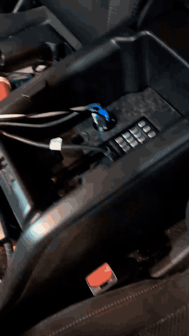
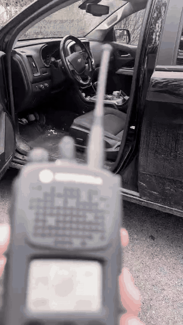

# Harris XG-100M Vehicle Integration

Private portfolio draft. Do not publish until the evidence and redaction review is complete.

## Purpose

This repository documents a vehicle communications integration project centered on a Harris XG-100M mobile radio installation. The current evidence set is strongest for the audio/speaker and console-fitment portion of the install: designing a clean speaker location, fabricating a protective grille, fitting it into the vehicle interior, and leaving the installation serviceable for future radio, power, RF, and accessory-cable work.

The portfolio goal is to show practical communications-equipment installation thinking: physical fit, usable audio, cable/interface planning, safety boundaries, and field-service style verification.

## Current Status

| Area | Status | Evidence |
|---|---|---|
| XG-100M control-head/dash placement | Documented | 2025-04-28 verified animated GIF |
| Speaker grille fabrication | Documented | 3-image Instagram carousel |
| Vehicle console speaker fitment | Documented | Installed close-up and wider view |
| Radio body/control-head mounting | Further documented | Control-head/dash evidence plus selected vehicle radio context clips; power/RF routing still needs documentation |
| Power/fusing/grounding plan | Needs write-up | Use sanitized values only |
| Antenna/feedline routing | Needs evidence | Photos/diagram still needed |
| Accessory/audio/PTT cabling | Needs write-up | Public-source pinout references only |
| RF/audio verification | Needs checklist | No operational frequencies or codeplug details |

## Evidence

See [docs/evidence-gallery.md](docs/evidence-gallery.md) for the private review gallery.

Current active media:

| File | What It Shows | Portfolio Value |
|---|---|---|
| `assets/xg100m-progress-2025-04-28-01.gif` | XG-100M control head/radio visible in vehicle dash area | Installed-position evidence, control-head access, vehicle integration progress |
| `assets/xg100m-vehicle-radio-context-2025-05-08-01.gif` | Vehicle radio/control-head context from selected ChatExport video | Additional installed-equipment context and operator-access evidence |
| `assets/xg100m-handheld-vehicle-context-2025-05-08-01.gif` | Handheld radio and vehicle cabin context from selected ChatExport video | Field-radio context around the vehicle integration environment |
| `assets/xg100m-speaker-integration-2025-03-30-01.jpg` | Fabricated speaker grille before installation | Mechanical fitment, fabricated protective cover, bench/workflow evidence |
| `assets/xg100m-speaker-integration-2025-03-30-02.jpg` | Installed grille close-up | Finished panel fit, fastener placement, speaker protection |
| `assets/xg100m-speaker-integration-2025-03-30-03.jpg` | Wider installed vehicle view | Placement, accessibility, integration into existing interior trim |

## Installation Narrative

### Problem

Mobile radio audio needs to be usable in a vehicle without leaving a loose speaker, exposed driver, or fragile wiring in the cabin. The install also needs to preserve serviceability: a future technician should be able to inspect, remove, or modify the speaker assembly without tearing apart unrelated interior components.

### Constraints

- Limited interior space around the console and lower trim.
- Audio needs to remain audible while the speaker remains physically protected.
- Hardware must not interfere with driving controls, occupant movement, or normal vehicle use.
- Public documentation must avoid operational radio configuration, proprietary Harris material, and sensitive identifiers.

### Approach

1. Identify a panel location that keeps radio audio close to the operator while avoiding clutter.
2. Use a compact speaker position behind a protective grille.
3. Fabricate a low-profile grille with enough open area for audio while protecting the speaker cone.
4. Mount the grille with visible service fasteners instead of hiding the assembly permanently.
5. Reserve the rest of the installation documentation for sanitized diagrams and checklists: power, fusing, grounding, antenna/feedline routing, and accessory-cable interfaces.

### Selected Vehicle Radio Context

The selected video evidence below adds motion context around radio placement, cabin access, and field-radio handling. It strengthens the portfolio story around practical vehicle communications integration, while remaining private-review material until displays, identifiers, and surrounding details are checked.

 

### What This Demonstrates

- Mechanical integration in a vehicle interior.
- Fabrication of a functional part rather than a decorative cover.
- Awareness of serviceability, fastener access, and future troubleshooting.
- Communications installation thinking: audio path, operator usability, cable planning, and sensitive-configuration boundaries.

## Verification Plan

The final public version should include a sanitized checklist using this structure:

| Check | Method | Result |
|---|---|---|
| Physical retention | Inspect fasteners and grille movement | Pending write-up |
| Speaker protection | Verify cone/driver is not exposed to cargo or footwell contact | Pending write-up |
| Audio clarity | Receive/monitor non-sensitive test audio | Pending write-up |
| Cable strain relief | Inspect route and bend radius behind panel | Pending evidence |
| Power safety | Confirm fuse location and wire protection | Pending sanitized diagram |
| RF path | Confirm antenna/feedline route and connector condition | Pending evidence |

## Troubleshooting Template

Use this pattern for any installation fault notes:

1. Symptom
2. Initial inspection
3. Measurement or continuity check
4. Diagnosis
5. Corrective action
6. Verification

Example topics to document later:

- weak or muffled audio after panel installation
- vibration/rattle around the grille
- connector strain or intermittent accessory audio
- power drop, fuse issue, or grounding fault
- feedline routing, connector, or antenna SWR issue

## Sensitive Material Boundary

This repository must not publish:

- encryption keys, key-fill files, or key IDs
- proprietary Harris programming files, codeplugs, manuals, or non-public pinouts
- operational frequencies, talkgroups, radio IDs, serials, or unit IDs
- private vehicle identifiers, addresses, or location details
- screenshots that expose sensitive radio configuration
- credentials, certificates, tokens, or private infrastructure details

Public diagrams should be recreated from scratch with placeholders and public information only.

## Next Work

- Add a sanitized vehicle communications block diagram.
- Add photos or diagrams for radio body/control-head placement.
- Add power, fuse, and grounding notes using generic values.
- Add antenna/feedline routing evidence if safe.
- Add accessory/audio/PTT cable notes based only on public or user-created references.
- Write one or two troubleshooting notes using the field-service pattern above.
