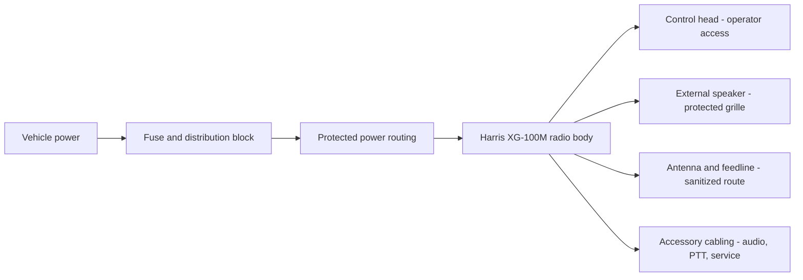

# Harris XG-100M Vehicle Integration

Public-safe project case study for vehicle communications integration around a Harris XG-100M mobile radio installation.

## Purpose

Vehicle communications integration around a Harris XG-100M mobile radio. The project emphasizes the parts a field installer or reviewer can evaluate publicly: control-head fitment, speaker integration, power routing, cable-path planning, service access, and clear redaction boundaries.

## Key Results

- Modeled and fit a control-head console insert before later install work.
- Documented protected speaker/grille integration and serviceable mounting.
- Added public-safe power-distribution and routing documentation.
- Kept radio programming, identifiers, key material, and private vehicle details out of scope.

## Project Outcomes

The project now reads as a practical install case study: design the fit, check the physical placement, document power/routing context, and preserve serviceability. The remaining public gaps are grounding, RF/feedline, antenna, strain relief, and audio-verification notes when those can be shown without sensitive detail.

## Methodology And Obstacles

The work moved from model to fit check before committing to installed hardware. Console geometry, cable pass-through, microphone placement, speaker protection, and service access were treated as practical constraints rather than cosmetic details. The main obstacles were limited interior space, routing power cleanly without exposing vehicle details, and documenting enough of the install to show competence without publishing radio configuration or protected identifiers.

## Resume Bullets

- Documented Harris XG-100M vehicle integration with emphasis on operator access, serviceability, audio usability, and safe public documentation.
- Designed and fit console/control-head and speaker-integration elements while preserving inspection and future troubleshooting access.
- Applied field-service thinking to physical retention, cable routing, power distribution, strain relief, and sensitive-configuration boundaries.

## Installation Narrative

### Problem

Mobile radio audio needs to be usable in a vehicle without leaving a loose speaker, exposed driver, or fragile wiring in the cabin. The install also needs to preserve serviceability: a future technician should be able to inspect, remove, or modify the speaker assembly without tearing apart unrelated interior components.

### Constraints

- Limited interior space around the console and lower trim.
- Audio needs to remain audible while the speaker remains physically protected.
- Hardware must not interfere with driving controls, occupant movement, or normal vehicle use.
- Public documentation must avoid operational radio configuration, proprietary Harris material, and sensitive identifiers.

### Approach

1. Identify a panel location that keeps radio audio close to the operator while avoiding clutter.
2. Use a compact speaker position behind a protective grille.
3. Fabricate a low-profile grille with enough open area for audio while protecting the speaker cone.
4. Mount the grille with visible service fasteners instead of hiding the assembly permanently.
5. Keep the remaining install notes concise and public-safe: power, fusing, grounding, antenna/feedline routing, and accessory-cable interfaces.

### Initial CAD Modeling And Control-Head Fitment

The install started with a CAD fitment pass for the control head and center-console pocket. These images show the transition from a simple tray/retention model to an initial physical fit check in the truck console.

 

This sequence documents the front end of the installation workflow: model the console insert, represent the radio control head in the design, then verify that the idea makes physical sense in the actual vehicle console before moving into later speaker, power, and cable-path work.

#### Fitment Revisions

The next useful revision added pass-through openings and refined the console insert geometry, then checked the updated tray with the control head, cabling, and microphone placement in the truck center console.

 

 

### Power Distribution And Routing

This sequence documents the XG-100M installation power distribution and routing workflow: open-console inspection, component placement, battery-area routing context, fuse/distribution placement, and service-access planning.

 

 

The cropped fuse-block image is included as physical installation evidence only: fuse/distribution placement, wire routing, and service access. The original image area containing readable vehicle/battery label details was removed before publication.

These photos are intentionally framed as installation documentation rather than operational radio documentation. They show fit, access, cable path, and power-path context without publishing radio programming, identifiers, or protected configuration details.

### Selected Vehicle Radio Context

The selected video clips add motion context around radio placement, cabin access, and field-radio handling. Public-facing clips should stay limited to sanitized views with displays, identifiers, and surrounding details checked.

 

### What This Demonstrates

- Mechanical integration in a vehicle interior.
- Fabrication of a functional part rather than a decorative cover.
- Awareness of serviceability, fastener access, and future troubleshooting.
- Communications installation thinking: audio path, operator usability, cable planning, and sensitive-configuration boundaries.

## Current Status

The public repo now covers the visible install story: control-head fitment, speaker/grille fabrication, console placement, vehicle radio context, and power-distribution/routing. The remaining public gaps are grounding detail, antenna/feedline routing, accessory/audio/PTT cabling, and RF/audio verification notes that can be shown without operational frequencies, codeplug details, identifiers, or private vehicle information.

## Project Media

See [docs/evidence-gallery.md](docs/evidence-gallery.md) for the full media gallery. The README keeps only representative images so the install story stays readable at a glance.

## Verification Plan

Future public notes should stay focused on inspection rather than operational configuration: physical retention, speaker protection, audio clarity, cable strain relief, power safety, and RF path condition. Any verification write-up should use sanitized placeholders and avoid frequencies, codeplug details, identifiers, or private routing information.

## Troubleshooting Template

Use this pattern for any installation fault notes:

1. Symptom
2. Initial inspection
3. Measurement or continuity check
4. Diagnosis
5. Corrective action
6. Verification

Example topics to document later:

- weak or muffled audio after panel installation
- vibration/rattle around the grille
- connector strain or intermittent accessory audio
- power drop, fuse issue, or grounding fault
- feedline routing, connector, or antenna SWR issue

## Sensitive Material Boundary

This repository must not publish:

- encryption keys, key-fill files, or key IDs
- proprietary Harris programming files, codeplugs, manuals, or non-public pinouts
- operational frequencies, talkgroups, radio IDs, serials, or unit IDs
- private vehicle identifiers, addresses, or location details
- screenshots that expose sensitive radio configuration
- credentials, certificates, tokens, or private infrastructure details

Public diagrams should be recreated from scratch with placeholders and public information only.

## Next Work

- Add photos or diagrams for radio body/control-head placement.
- Add power, fuse, and grounding notes using generic values.
- Add antenna/feedline routing documentation if safe.
- Add accessory/audio/PTT cable notes based only on public or user-created references.
- Write one or two troubleshooting notes using the field-service pattern above.
