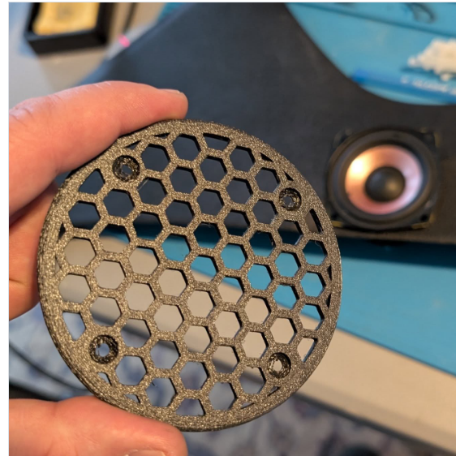
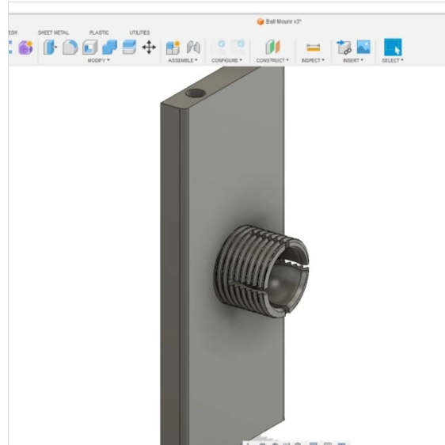
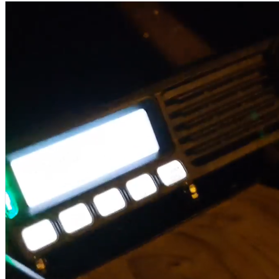
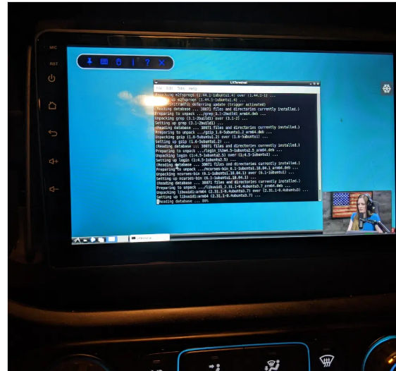
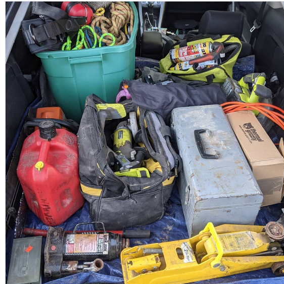
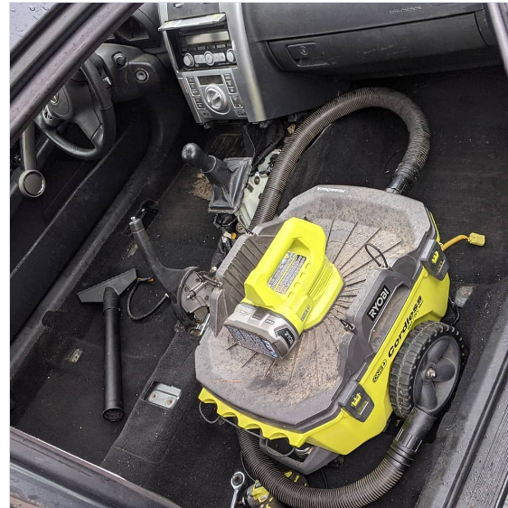

# Evidence Gallery

Private draft. Images in this repository were captured from Josh's Instagram evidence posts for internal review. Do not make public until each image has passed the sanitization review in `docs/sanitization-notes.md`.

## Lead Installation Evidence

### Harris XG-100M Progress

- Source: Instagram, 2025-04-28.
- Portfolio value: direct evidence of Harris XG-100M vehicle integration progress.
- Review note: check display, visible labels, and any device identifiers before public use.

### Center-Console Speaker Integration

- Source: Instagram, 2025-03-30.
- Portfolio value: strongest direct installation/fabrication image in this set.
- Review note: likely safe after final visual check; add text explaining speaker choice, mounting constraints, and fitment.

## Supporting Vehicle Integration Evidence

### Custom Truck Tablet / Radio Mount CAD

- Source: Instagram, 2024-08-05.
- Portfolio value: supports vehicle-ready CAD/fabrication work for radio, laptop, and tablet mounting.
- Review note: check for filenames, project names, or UI details before public use.

### Vehicle Radio / ATC Monitoring

- Source: Instagram, 2020-12-03.
- Portfolio value: supports vehicle-mounted radio experimentation and aviation-band monitoring interest.
- Review note: crop or redact if any frequency/channel information is legible.

### Android Car-Radio Ubuntu VM

- Source: Instagram, 2023-08-30.
- Portfolio value: supports field-systems experimentation, Linux troubleshooting, and unconventional vehicle compute integration.
- Review note: inspect terminal output before public use.

## Field-Service Context

### Vehicle Tool / Field Gear Loadout

- Source: Instagram, 2021-04-10.
- Portfolio value: supporting context for field readiness, tools, and vehicle-based troubleshooting.
- Review note: check for personal/private items before public use.

### Vehicle Troubleshooting

- Source: Instagram, 2020-12-05.
- Portfolio value: supporting evidence for hands-on vehicle troubleshooting.
- Review note: add a concise symptom-to-fix write-up if Josh wants this included publicly.
