# Evidence Gallery

Public-safe gallery derived from a private source archive.

Media rule: still evidence is stored as JPG; verified video evidence is stored as animated GIF.

## Xg100M Progress

- Source: Private source archive; public-safe derivative

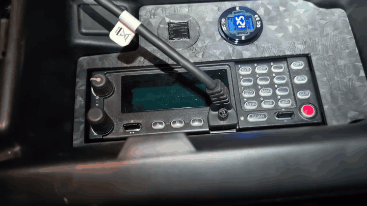

## Selected Vehicle Radio Context

- Source: Private source archive.
- Boundary: vehicle identifiers, radio display details, IDs, frequencies, and key material are kept out of the public narrative.

 

## Initial CAD Modeling And Control-Head Fitment

- Source: Private source archive; public-safe derivative.
- Boundary: these images show user-created fitment modeling and physical placement context only. They do not publish radio programming, protected configuration, identifiers, or service-manual material.

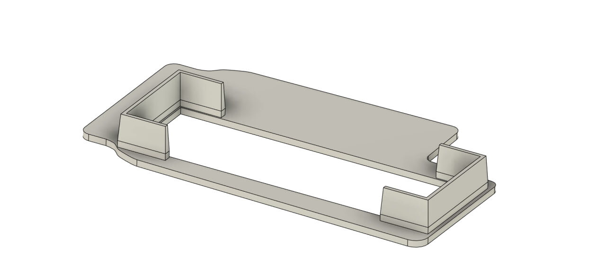 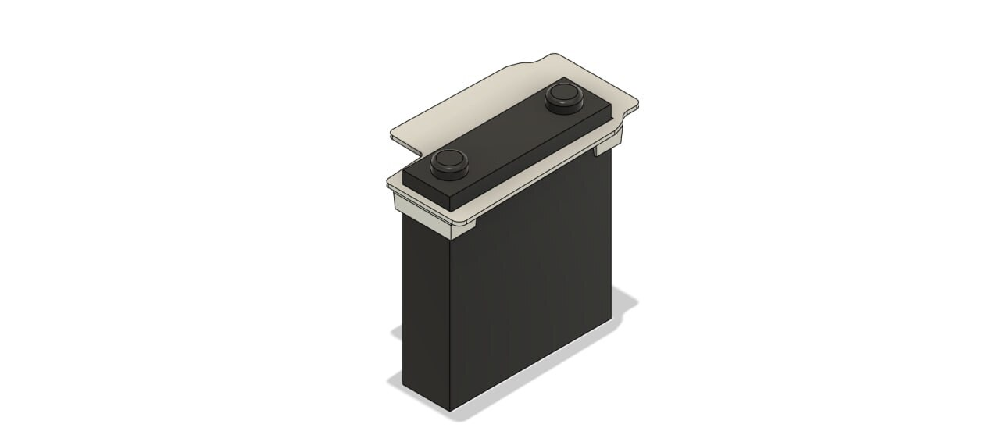

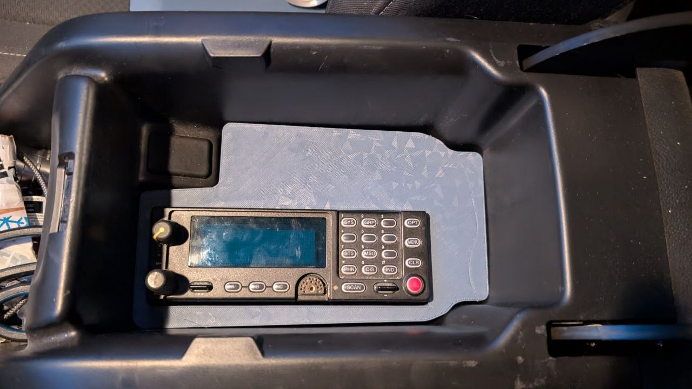

### Fitment Revisions

- Source: Private source archive; public-safe derivative.
- Boundary: these images document revised console-insert geometry, control-head fitment, cable clearance, and microphone stowage only. Radio programming, identifiers, operational frequencies, key material, and private vehicle identifiers are not included.

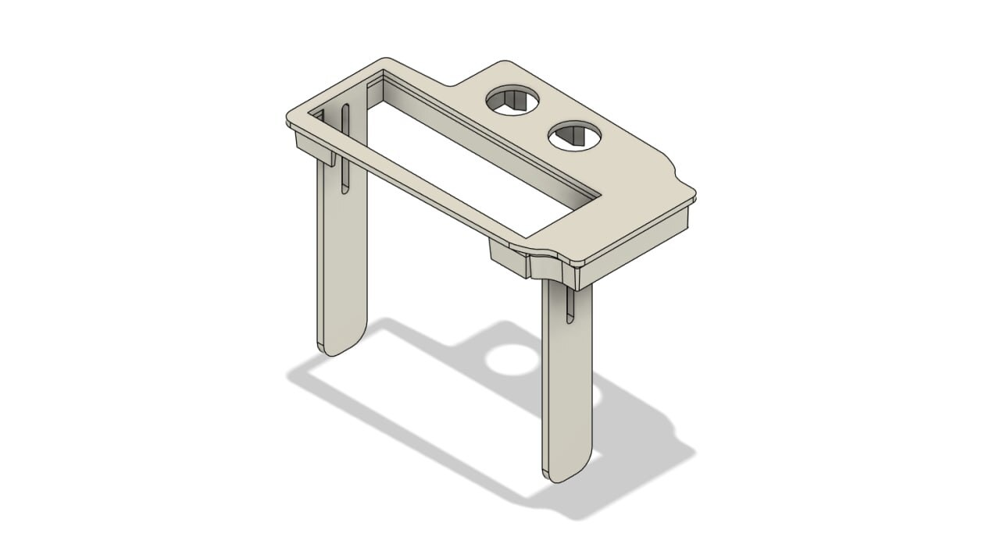 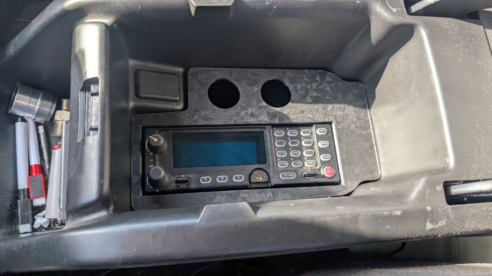

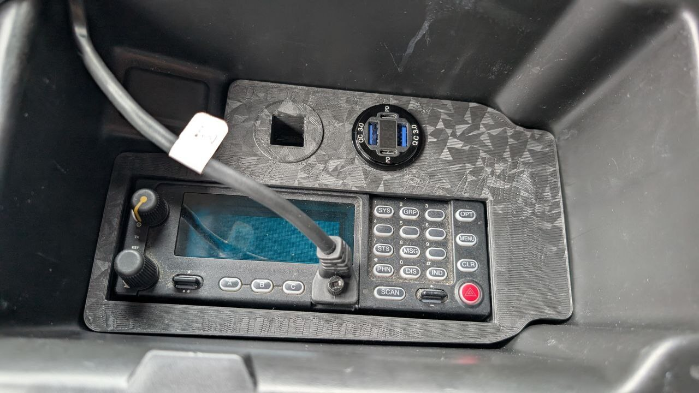 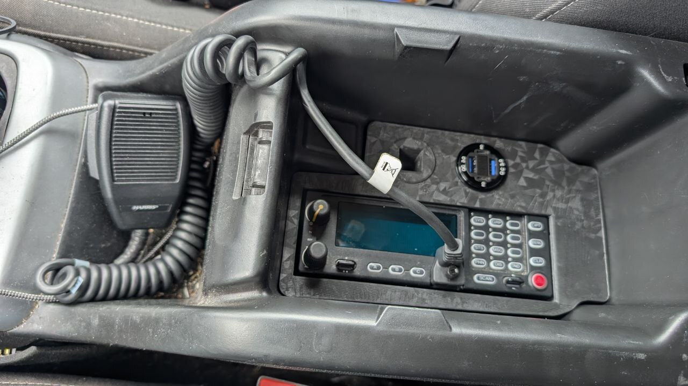

## Xg100M Speaker Integration

- Source: Private source archive; public-safe derivative

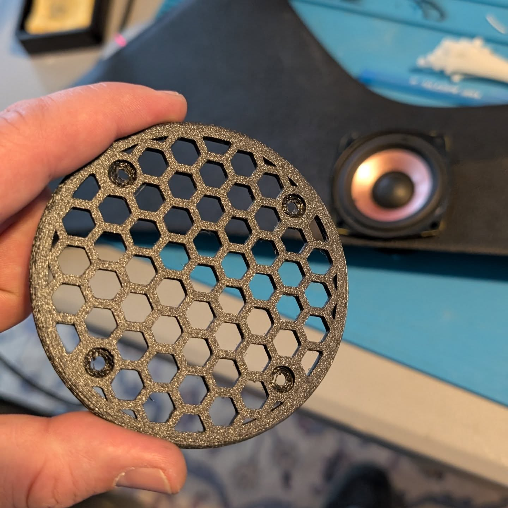 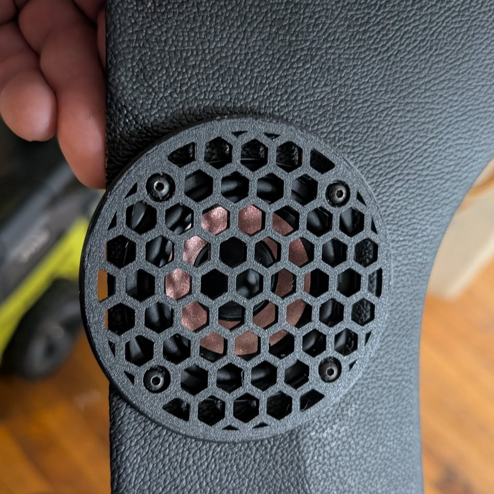

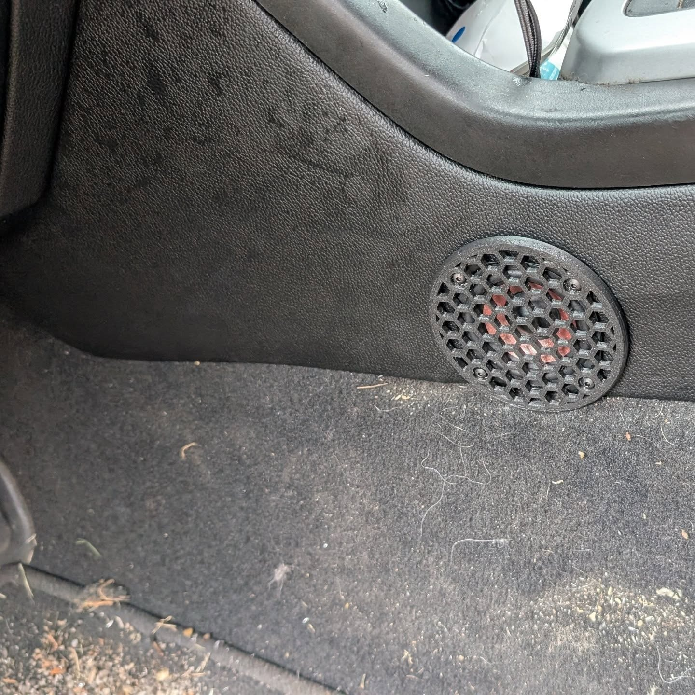

## Console Fitment And Service Access

- Source: Private source archive; public-safe derivative.
- Boundary: these photos document fitment, cable access, power-path context, and serviceability only. Radio programming, identifiers, operational frequencies, key material, and private vehicle identifiers are not included.

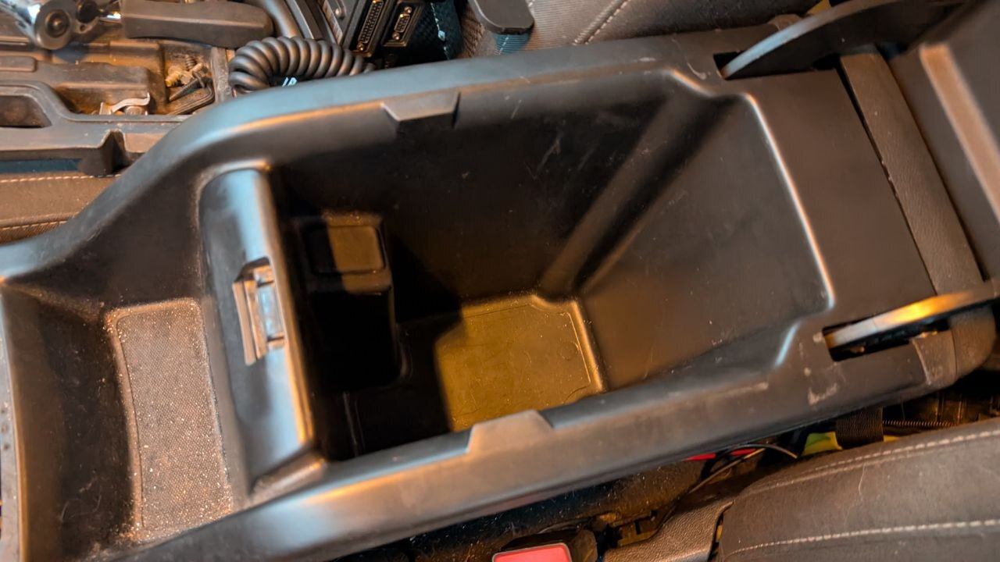 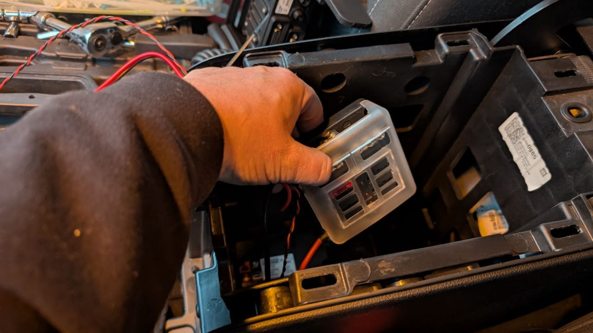

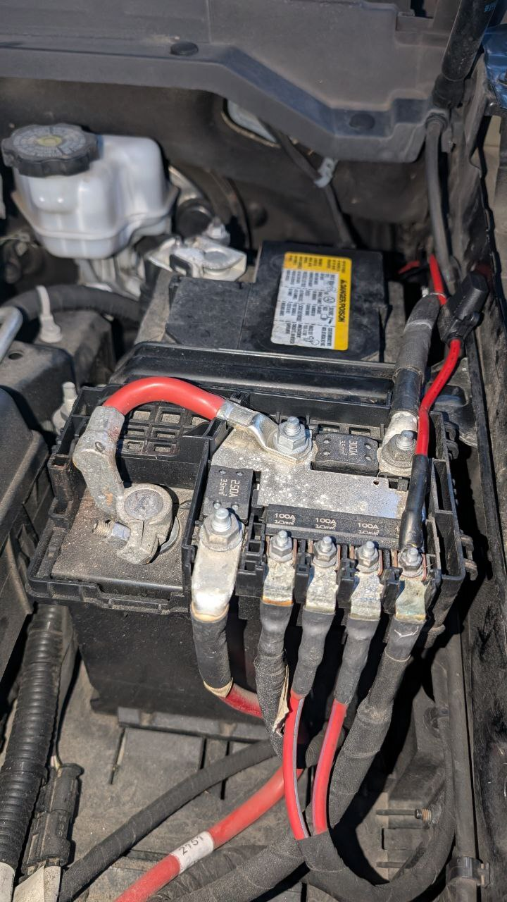 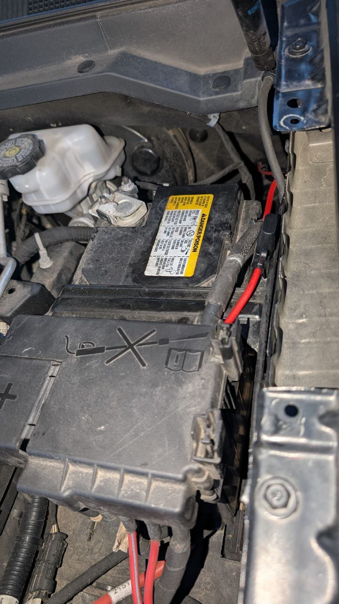

## Power Distribution

- Source: Private source archive; cropped public-safe derivative.
- Boundary: this image documents fused power-distribution and routing context only. Readable vehicle/battery label details were cropped out before publication.

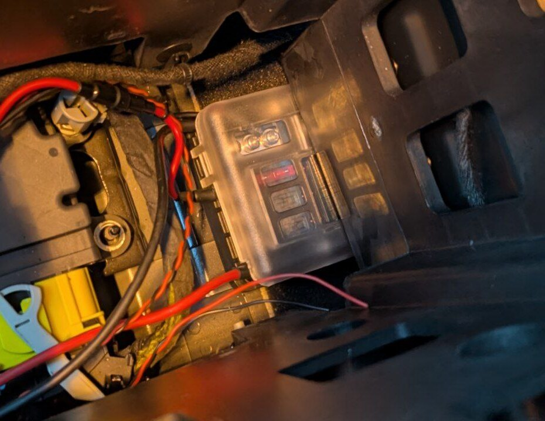
